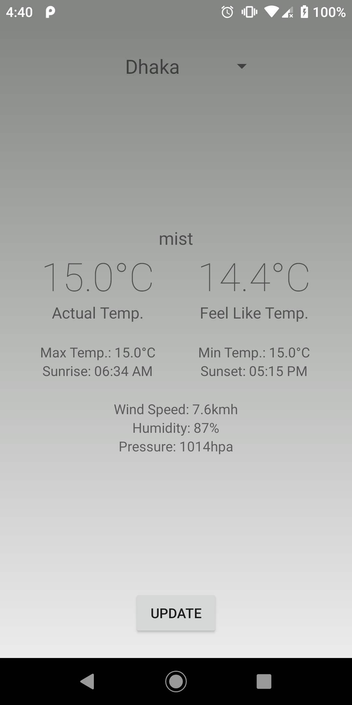
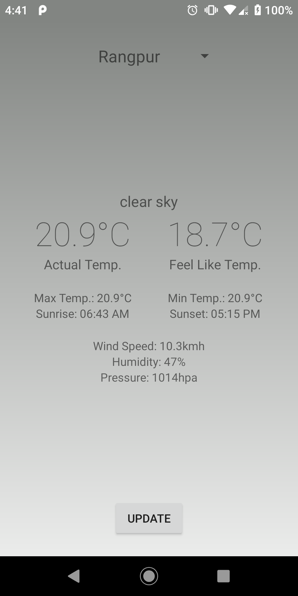

# Weather-App-for-Android-in-MVP-design
An Android app to get current weather status of selected cities using Java

Screenshots: 

Instruction:

1.Sign up and get your ApiKey from https://openweathermap.org/

2.add the ApiKey here at "APPID" in MagicLamp class 

